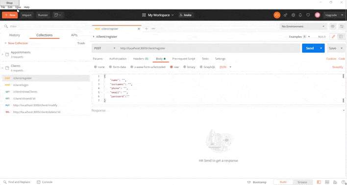

 # 🦷 AppDentalClinic 🦷

## Introduction

AppDentalClinic is an application for a Dental Clinic where clients can register and make appointments, cancel them or view them all. 

At the moment there is only the backend, but frontend will be added soon.

- Links: 
  - Repository: [GitHub](https://github.com/Agredas/AppDentalClinic)
  - Deployed in: [Heroku](https://app-dental-clinic-backend.herokuapp.com/client/showClients)

🔧Technologies🔨

- Javascript.
- NodeJS.
- Express.
- MongoDB.
- Mongoose.
- Mongo Atlas.
- JWT.
- Bycrpt.
- RegEx.
- Postman.
- Git.
- GitHub.
- Heroku.

# Important

## You need to have certain things installed:

- First Step: 
  > $ npm init -y
- Second Step: 
  > $ npm i express mongoose bcrypt

## How to use Postman?

If you want the endpoints to work properly you have to follow the correct route and write all the necessary elements in the body in order to send the information to the MongoDB Atlas.

The following video shows how.

> Note: Where it says POST, you can change it to GET, PUT or DELETE.

# Endpoints 📍

## Clients: 

- POST /client/register ➡ A new client is added.
- POST /client/login ➡ Client logs into his account.
- POST /client/logout ➡ Client extis his acccount.
- GET /client/showClients ➡ Show all clients.
- GET /client/showId/:id ➡ Show a client by his id.
- PUT /client/modify ➡ Modify a client.
- DELETE /client/delete/:id ➡ Delete a client by his id.

## Appointments: 

- POST /appointment/create ➡ Client can create an appointment.
- DELETE /appointment/cancel/:id ➡ Client can cancel an appointment.
- GET /appointment/show ➡ All appointments are displayed.
